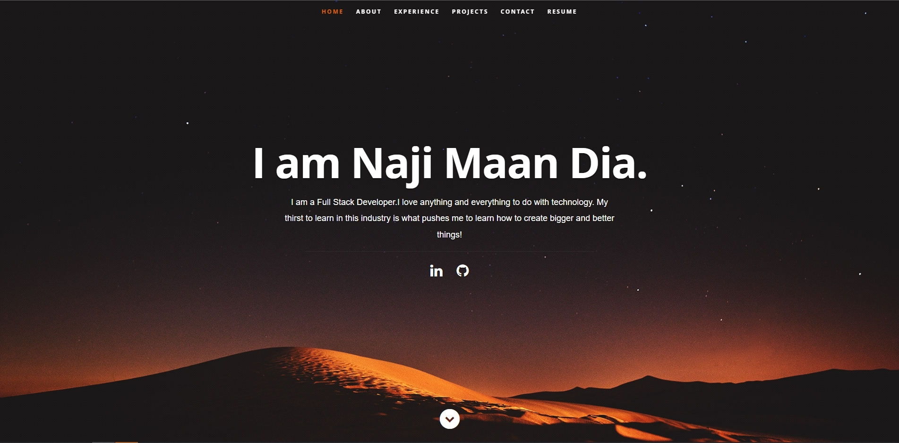

# HW16-React-Port

## Description
- The motivation was to utilize react to build a portfolio.
- Learn how to implement components and props of data for each component. 
- Have different components on the page work within each other based on page setup.
- Learned how to use react to create a modernized portfolio.

## Table of Contents (Optional)
- [Installation](#installation)
- [Usage](#usage)
- [License](#license)
- [Features](#features)

## Usage

[Netlify Deployed Application](https://romantic-golick-edb0ca.netlify.app/)

## License

